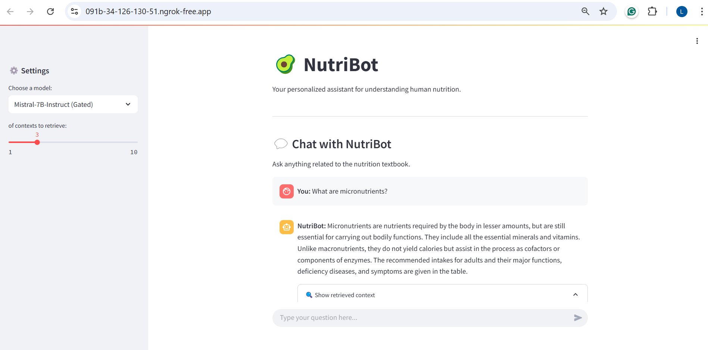
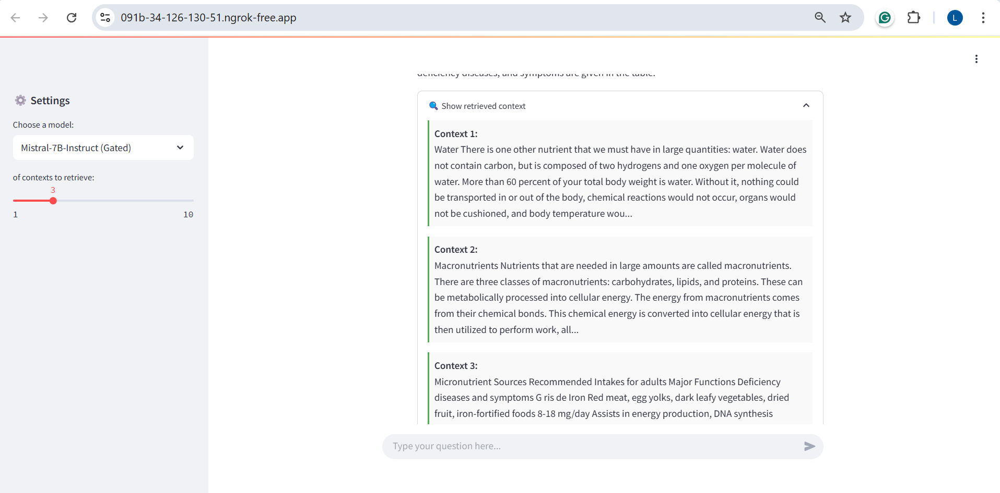

# 🥑 NutriBot: Your Nutrition Assistant

NutriBot is a conversational AI application designed to help users understand and explore a human nutrition textbook using a Retrieval-Augmented Generation (RAG) pipeline. It integrates a Streamlit interface, sentence embedding, FAISS vector search, and LLM-based text generation- powered with LangChain for more robust context handling and modularity.

---

## 🚀 Features

- 📄 Loads content from a publicly available Human Nutrition PDF.
- ✂️ Splits text into manageable sentence chunks.
- 🔍 Embeds chunks using Sentence Transformers.
- 🧠 Searches relevant context using FAISS.
- 🤖 Generates answers using your selected Hugging Face LLM.
- 🔗 Enhanced retrieval + reasoning using LangChain.
- 💬 Continuous chatbot interface using Streamlit.
- 🔐 Hugging Face + ngrok token-based secure deployment.

---

## 📁 Folder Structure

```
NutriBot/
├── app.py                     # Main Streamlit chatbot app
├── requirements.txt          # All dependencies (GPU + CPU safe)
├── colab_launcher.ipynb      # One-click launcher for Colab
├── README.md                 # This file
├── src/                      # All backend modules
│   ├── loader.py             # PDF downloading and text extraction
│   ├── chunker.py            # Sentence splitting and chunking
│   ├── embedder.py          # Sentence embeddings via HF models
│   ├── langchain_pipeline.py # LangChain-powered RAG pipeline
│   └── vector_store.py       # FAISS-based vector index management
```

---

## ✅ Requirements

Python >= 3.10 (recommended to use Colab or a virtualenv)

---

## 📦 `requirements.txt`

This includes:
- GPU-enabled PyTorch (CUDA 12.1)
- FAISS-CPU for stable vector search
- LLM and NLP libraries
- LangChain for orchestrated RAG
- Streamlit + ngrok for UI and tunneling

Install everything in one go:
```bash
pip install -r requirements.txt
```

> ⚠️ If using **Google Colab**, let preinstalled versions of `pandas`, `numpy`, and `torch` remain. Avoid downgrading them.

---

## 📘 Run in Google Colab (RECOMMENDED)

Launch NutriBot instantly in Colab by clicking the badge below:

[](https://colab.research.google.com/github/LavanyaGovindaraju/Nutri_ChatBot/blob/main/colab_nutribot_launcher.ipynb)

### 🔹 Before You Run
- **File > Save a copy in Drive** — this allows you to edit and run the notebook freely.
- The notebook will:
  1. Install all required packages
  2. Prompt you for your Hugging Face and ngrok tokens
  3. Launch the app via Streamlit
  4. Show a live chatbot URL using ngrok

> 🔐 No secrets are hardcoded. Your tokens are only used in the current Colab session.

---

## 🔑 Required Tokens

### 🔐 Hugging Face Token
Used to load models like TinyLlama, Phi-2, Falcon, or Mistral. Get it from:
https://huggingface.co/settings/tokens

### 🔐 ngrok Token
Used to tunnel your Streamlit app publicly from Colab:
https://dashboard.ngrok.com/get-started/your-authtoken

---

## 🧠 Model Selection
In the sidebar of the app, choose from the following:
- **TinyLlama** – 🐣 Smallest, fastest, good for Colab.
- **Phi-2** – 🧠 Microsoft’s mid-sized instruct-tuned model.
- **Falcon-7B-Instruct** – 🦅 Larger, better reasoning (slower).
- **Mistral-7B-Instruct** – 🌀 Gated model with high performance (requires HF token).

---

## 🗃️ How It Works (Under the Hood)

1. **PDF Loading** (`loader.py`)
   - Downloads the PDF if not present.
   - Uses `PyMuPDF` to extract clean text.

2. **Text Chunking** (`chunker.py`)
   - Splits each page into overlapping sentence groups (e.g., 10-sentence chunks).

3. **Embedding** (`embedder.py`)
   - Uses SentenceTransformer to convert text chunks into embeddings.

4. **Vector Store** (`vector_store.py`)
   - FAISS index built over embeddings for fast similarity search.

5. **RAG Pipeline** (`langchain_pipeline.py`)
   - Uses LangChain to retrieve top-k chunks and pass them to the LLM.
   - Source documents are returned alongside the answer.

6. **Streamlit UI** (`app.py`)
   - Displays chat history in a modern conversational layout.
   - User at bottom, bot response + context in expandable sections.

---

## 📸 Screenshots




---

## 💡 Tips

- If GPU is unavailable, it falls back to CPU automatically.
- All embeddings are cached using `st.session_state`.
- You can update to your own nutrition dataset by swapping the PDF in `DocumentLoader`.

---

## 🤝 Contributing
Pull requests and improvements are welcome. Let's build better AI tutors together!

---

## 🛡 License
MIT License

---

## 📬 Contact
Made with 🥑 by [Lavanya Govindaraju]
- GitHub: https://github.com/LavanyaGovindaraju/NutriBot
- Email: lavanyagovindaraju20@gmail.com

